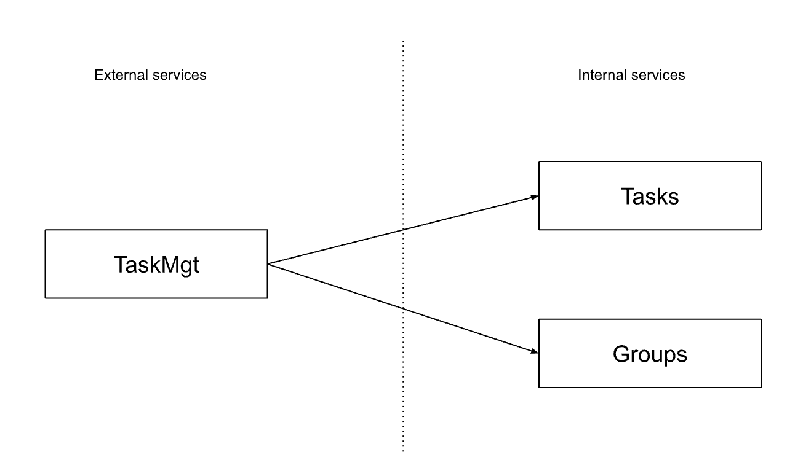

# KubeCon 2022 Detroit - Ballerina Demo
This usecase is closely related to the Choreo KubeCon 2022 demo application. It is designed only to showcase Ballerina language capabilities. 

Here is list of services and their interactions:    

## Prerequisites
- Ballerina 2201.2.2 (Swan Lake Update 2) or greater

## Script
Explain the usecase using the above image and then move onto the VSCode. The goal is to develop the taskmgt service eventually.

### demo_01.bal
- Introduce Ballerina, bal command and the VSCode plugin
- Show the simple helloworld function
- Explain the syntax familiarity
### demo_02.bal
- Explain the first-class language support for providing and consuming services 
- The focus of this step is consuming services 
- Use the http:Client to invoke a resource 
- Introduce configurability in Ballerina programs
- Explain error handling in Ballerina briefly with union types and `check` semantics 
- Assign the payload to a `json` variable to show the built-in native support
- [Optional] Use the latest client import and client resource invocation features 
### demo_03.bal
- Now explain the recommended approach of using application-specific types 
- Define a record type and show automatic databidning capability in the http client
- Explain open and closed record types and why they are useful
- Show the sequence diagram and explain the bidirectional mapping between code and the sequence diagram 
### demo_04.bal
- Extend the previous example to show query expressions in Ballerina
- Show how query expressions can be used to query lists: declarative SQL-like queries
### demo_05.bal
- Extend the previous example by adding another service interaction
- Explain how to use the task service to get the list of tasks with a given groupId 
- Show the sequence diagram with two service interactions
### demo_06.bal
- Introduce service construct in the language
- Explain resource functions and remote functions 
- Define resource functions for one or more resources in the services
- Show the resource view in the diagram
### demo_07.bal
### demo_08.bal
- Show c2c capabilities 
